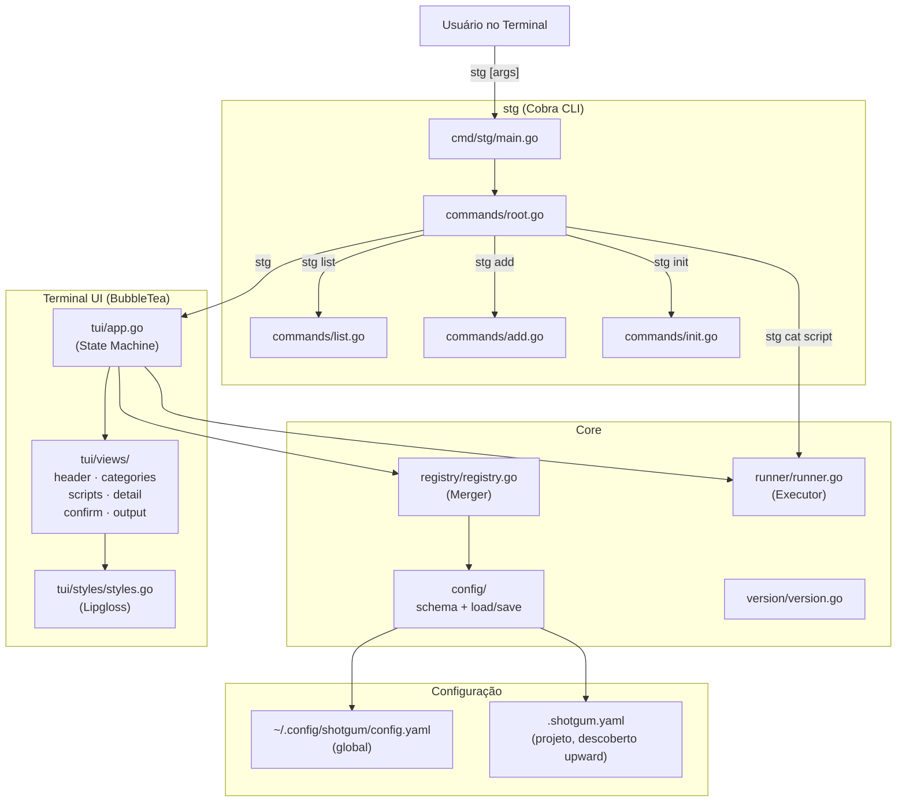

# ShotGum Toolchain — Project Overview

## O que é o ShotGum Toolchain?

O `stg` (ShotGum Toolchain) é uma ferramenta CLI/TUI para **gerenciar e executar scripts de shell organizados por categoria**. Ele atua como um lançador de scripts com interface interativa (TUI) construída com BubbleTea, ou como runner direto via linha de comando.

O projeto resolve o problema de scripts espalhados por projetos: o `stg` agrega scripts locais (projeto) e globais (usuário) num único catálogo navegável, com suporte a execução interativa via `gum`.

---

## Objetivos de Produto

| Objetivo | Descrição |
|---|---|
| Catálogo unificado | Combinar scripts globais (~/.config/shotgum) e locais (.shotgum.yaml) |
| Interface TUI | Navegação visual por categorias e scripts com BubbleTea |
| Execução direta | Suporte a `stg <cat> <script> [args]` sem abrir o TUI |
| Integração com gum | Scripts detectam TTY e adaptam prompts interativos |
| Portabilidade | Instalação via curl, binários para linux/mac/windows |

---

## Diagrama de Alto Nível



---

## Tecnologias

| Tecnologia | Versão | Uso |
|---|---|---|
| Go | 1.22 | Linguagem principal |
| BubbleTea | v1.2.4 | Framework TUI (Elm Architecture) |
| Bubbles | v0.20.0 | Componentes: list, viewport, spinner, textinput |
| Lipgloss | v1.0.0 | Estilização terminal |
| Cobra | v1.8.1 | CLI framework |
| gopkg.in/yaml.v3 | v3.0.1 | Parsing de configuração |

---

## Estrutura de Diretórios

```
ShotGum-Toolchain/
├── cmd/stg/main.go              # Entry point
├── internal/
│   ├── commands/                # Cobra subcomandos (root, list, add, init, run)
│   ├── config/                  # Schema + load/save de configuração YAML
│   ├── registry/                # Merger de config global + local
│   ├── runner/                  # Execução de scripts (capturada e streaming)
│   ├── tui/
│   │   ├── app.go               # State machine BubbleTea
│   │   ├── views/               # Componentes visuais (header, categories, scripts, detail, confirm, output)
│   │   └── styles/              # Paleta de cores e estilos Lipgloss
│   └── version/                 # Variável de versão injetada em build
├── testenv/
│   ├── .shotgum.yaml            # Config local de teste com 8 scripts demo
│   └── scripts/                 # Scripts shell com integração gum
├── assets/                      # Logo e imagens
├── .github/workflows/release.yml # CI/CD para releases
├── Makefile                     # Build, test, snapshot, install
├── install.sh                   # Instalador universal via curl
└── README.md
```

---

## Índice dos PRDs

| Arquivo | Conteúdo |
|---|---|
| [01-configuration.md](./01-configuration.md) | Schema YAML, hierarquia de config, loading |
| [02-tui-state-machine.md](./02-tui-state-machine.md) | Estados TUI, transições, key bindings |
| [03-script-execution.md](./03-script-execution.md) | Modos de execução, runner, TTY detection |
| [04-registry.md](./04-registry.md) | Merge global+local, precedência, resolução de paths |
| [05-cli-commands.md](./05-cli-commands.md) | Subcomandos CLI, roteamento, flags |
| [06-layout-and-styling.md](./06-layout-and-styling.md) | Layout two-panel, cálculo de dimensões, estilos |
| [07-versioning-and-release.md](./07-versioning-and-release.md) | Version injection, CI/CD, instalador |
| [08-business-rules.md](./08-business-rules.md) | Consolidação de todas as regras de negócio |
