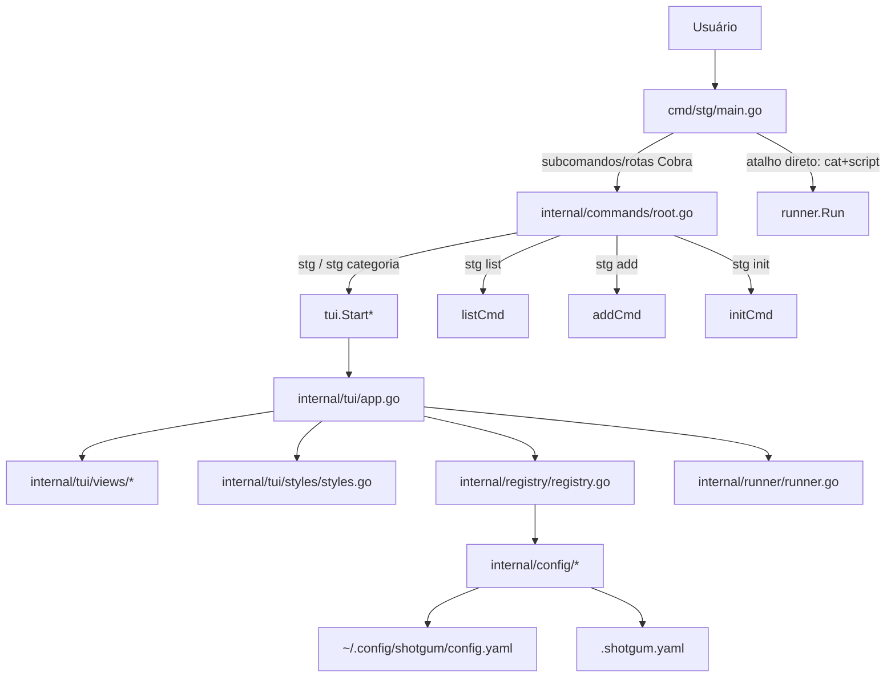

# ShotGum Toolchain — Visão Geral do Projeto

## O que é

O `stg` é uma ferramenta CLI/TUI para catalogar e executar scripts de shell, combinando configuração global (usuário) e local (projeto).

## Objetivos de Produto

| Objetivo | Descrição |
|---|---|
| Catálogo unificado | Mesclar scripts locais (`.shotgum.yaml`) e globais (`~/.config/shotgum/config.yaml`) |
| Interface interativa | Navegação no terminal com BubbleTea + Bubbles |
| Execução direta | Rodar `stg <categoria> <script> [args...]` sem abrir TUI |
| Execução interativa | No TUI, executar scripts com entrada/saída ao vivo |
| Simplicidade operacional | Setup com `stg init`, `stg add`, `stg list` |

## Arquitetura Atual (Alto Nível)



## Estrutura Atual do Repositório

```text
ShotGum-Toolchain/
├── cmd/stg/main.go
├── internal/
│   ├── commands/      # root, add, init, list, run
│   ├── config/        # schema + load/save + defaults
│   ├── registry/      # merge local+global + resolução
│   ├── runner/        # execução direta/capturada/interativa
│   ├── tui/
│   │   ├── app.go     # state machine principal
│   │   ├── styles/    # paleta e estilos lipgloss
│   │   └── views/     # header, listas, detail, output, confirm
│   └── version/       # version.Version injetada por ldflags
├── defaults/scripts/  # scripts padrão (star.sh, issue.sh)
├── docs/PRDs/
├── shotgum-playground/
├── .github/workflows/ci.yml
├── Makefile
└── install.sh
```

## Observações de Estado Atual

- O fluxo ativo da TUI usa `stateCategories`, `stateScripts` e `stateOutput`.
- `stateConfirm` e `views/confirm.go` existem no código, mas não estão no fluxo principal atual.
- O repositório tem workflow de CI (`ci.yml`), sem pipeline de release automatizado neste momento.

## Índice dos PRDs

| Arquivo | Conteúdo |
|---|---|
| [01-configuration.md](./01-configuration.md) | Schema YAML e carregamento |
| [02-tui-state-machine.md](./02-tui-state-machine.md) | Estados, transições e atalhos |
| [03-script-execution.md](./03-script-execution.md) | Modos de execução e runner |
| [04-registry.md](./04-registry.md) | Merge e resolução de script/help/executable |
| [05-cli-commands.md](./05-cli-commands.md) | Rotas e subcomandos CLI |
| [06-layout-and-styling.md](./06-layout-and-styling.md) | Layout, estilos e componentes visuais |
| [07-versioning-and-release.md](./07-versioning-and-release.md) | Build/versionamento/CI/instalação |
| [08-business-rules.md](./08-business-rules.md) | Regras de negócio consolidadas |
