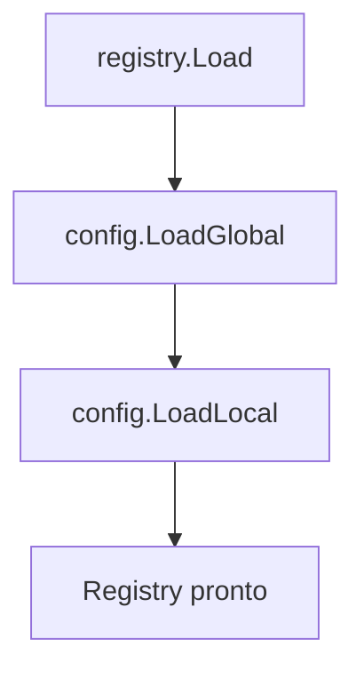

# PRD 01 — Sistema de Configuração

## Visão Geral

O ShotGum usa YAML com dois escopos:

- Global: `~/.config/shotgum/config.yaml`
- Local: `.shotgum.yaml` (descoberto subindo diretórios a partir do CWD)

## Schema Atual

```yaml
version: "1"
scripts_home: "~/.shotgum/scripts"
help_flag: "--help"
default_executable: "/bin/sh"

categories:
  - name: dev
    description: "Development scripts"
    scripts_path: "./scripts"
    help_flag: "--help"

scripts:
  - name: build
    category: dev
    description: "Build project"
    executable: "bash"      # opcional, sobrepõe default_executable
    path: "./build.sh"
    help_flag: "--help"
```

### Estruturas Go

```go
type Config struct {
    Version     string     `yaml:"version"`
    ScriptsHome string     `yaml:"scripts_home"`
    HelpFlag    string     `yaml:"help_flag"`
    DefaultExec string     `yaml:"default_executable"`
    Categories  []Category `yaml:"categories"`
    Scripts     []Script   `yaml:"scripts"`
    Source      string     `yaml:"-"`
}

type Script struct {
    Name        string `yaml:"name"`
    Category    string `yaml:"category"`
    Description string `yaml:"description"`
    Executable  string `yaml:"executable"`
    Path        string `yaml:"path"`
    HelpFlag    string `yaml:"help_flag"`
}
```

## Carregamento



Regras do loader (`internal/config/config.go`):

- Arquivo ausente retorna `nil` (não é erro).
- `Source` é definido em memória (`global`/`local`).
- `~` e `$ENV` são expandidos em:
  - `scripts_home`
  - `default_executable`
  - `categories[].scripts_path`
  - `scripts[].path`
  - `scripts[].executable`

## Descoberta de `.shotgum.yaml`

Busca do CWD até a raiz do filesystem, parando na primeira ocorrência.

## Inicialização (`stg init`)

`config.EnsureDefault()` cria, se necessário:

- `~/.config/shotgum/config.yaml`
- `~/.shotgum/scripts/`

Config default atual:

```yaml
version: "1"
scripts_home: "~/.shotgum/scripts"
help_flag: "--help"
default_executable: "/bin/sh"
```

## Regras de Negócio

| ID | Regra |
|---|---|
| R-CFG-01 | `Source` nunca é persistido no YAML |
| R-CFG-02 | Config ausente retorna `nil`, sem interromper o sistema |
| R-CFG-03 | Descoberta local depende do CWD no momento da execução |
| R-CFG-04 | `~` é expandido com `os.UserHomeDir()` |
| R-CFG-05 | `$VAR` é expandido com `os.ExpandEnv()` |
| R-CFG-06 | Defaults do `init`: `version=1`, `help_flag=--help`, `default_executable=/bin/sh` |
| R-CFG-07 | Campo de script para interpretador é `executable` (não `type`) |
| R-CFG-08 | `stg init` é idempotente |
