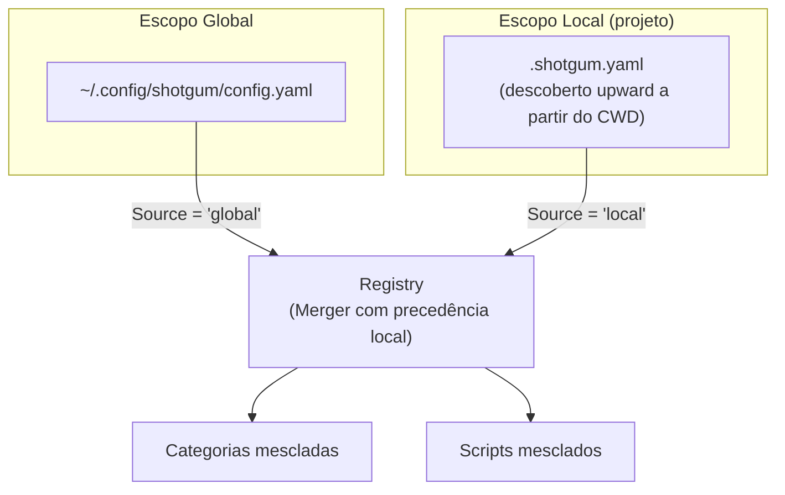
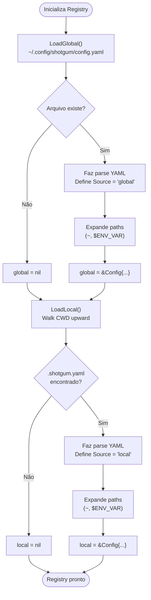
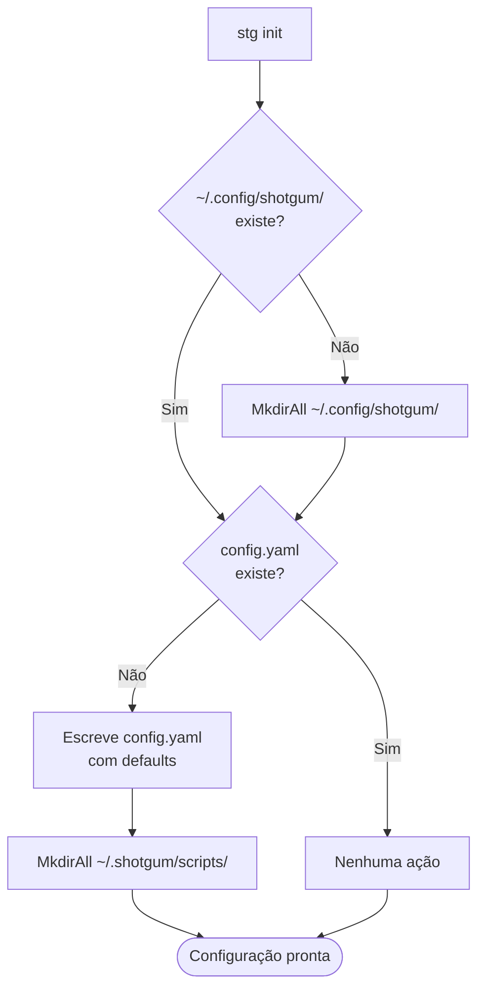

# PRD 01 — Sistema de Configuração

## Visão Geral

O ShotGum usa arquivos YAML para definir categorias e scripts. Existem dois escopos de configuração: **global** (usuário) e **local** (projeto). Ambos são carregados e mesclados pelo Registry com precedência local.

---

## Schema de Dados

### Config (raiz do YAML)

```yaml
version: "1"
scripts_home: "~/.shotgum/scripts"   # diretório padrão para scripts globais
help_flag: "--help"                   # flag padrão de help para scripts

categories:
  - name: dev
    description: "Development scripts"
    scripts_path: "./scripts"         # relativo ao arquivo YAML
    help_flag: "--help"               # override de categoria (opcional)

scripts:
  - name: build
    category: dev
    description: "Build the project"
    type: script                      # "script" | "executable"
    path: "./scripts/build.sh"
    help_flag: "--help"               # override de script (opcional)
```

### Estruturas Go

```go
// internal/config/schema.go

type Config struct {
    Version     string     `yaml:"version"`
    ScriptsHome string     `yaml:"scripts_home"`
    HelpFlag    string     `yaml:"help_flag"`
    Categories  []Category `yaml:"categories"`
    Scripts     []Script   `yaml:"scripts"`
    Source      string     // "global" | "local" — injetado no load, não no YAML
}

type Category struct {
    Name        string `yaml:"name"`
    Description string `yaml:"description"`
    ScriptsPath string `yaml:"scripts_path"`
    HelpFlag    string `yaml:"help_flag"`
}

type Script struct {
    Name        string `yaml:"name"`
    Category    string `yaml:"category"`
    Description string `yaml:"description"`
    Type        string `yaml:"type"`   // "script" | "executable"
    Path        string `yaml:"path"`
    HelpFlag    string `yaml:"help_flag"`
}
```

---

## Hierarquia de Configuração



---

## Fluxo de Loading



---

## Descoberta do Arquivo Local

O arquivo `.shotgum.yaml` é descoberto caminhando do CWD para a raiz, semelhante ao comportamento do `git`:


**Regra:** A busca para na primeira ocorrência de `.shotgum.yaml` encontrada ao subir nos diretórios. Se chegar na raiz do sistema de arquivos sem encontrar, `local = nil`.

---

## Expansão de Paths

Todos os paths em configuração passam por `expandPath()` antes de uso:

| Entrada | Resultado |
|---|---|
| `~/scripts` | `/home/user/scripts` |
| `$HOME/scripts` | `/home/user/scripts` |
| `$PROJECT_DIR/scripts` | `[valor de $PROJECT_DIR]/scripts` |
| `./scripts` | Mantido relativo (resolvido pelo Registry later) |
| `/absolute/path` | Mantido como está |

---

## Inicialização (First Run)

Quando o usuário executa `stg init`, o sistema garante a existência da configuração global padrão:



**Config padrão gerada:**
```yaml
version: "1"
scripts_home: "~/.shotgum/scripts"
help_flag: "--help"
categories: []
scripts: []
```

---

## Regras de Negócio

| # | Regra |
|---|---|
| R-CFG-01 | `Source` nunca é escrito no YAML — é injetado em memória no momento do load |
| R-CFG-02 | Um arquivo YAML ausente resulta em `nil`, não em erro — o sistema continua sem ele |
| R-CFG-03 | A descoberta local segue o CWD no momento de início do processo `stg` |
| R-CFG-04 | Paths com `~` são expandidos usando `os.UserHomeDir()` |
| R-CFG-05 | Paths com `$VAR` são expandidos usando `os.ExpandEnv()` |
| R-CFG-06 | `version: "1"` é o único schema suportado atualmente |
| R-CFG-07 | `scripts_home` só é usado como base de resolução quando um path de script é relativo e não há `scripts_path` de categoria |
| R-CFG-08 | `stg init` é idempotente — nunca sobrescreve config existente |
