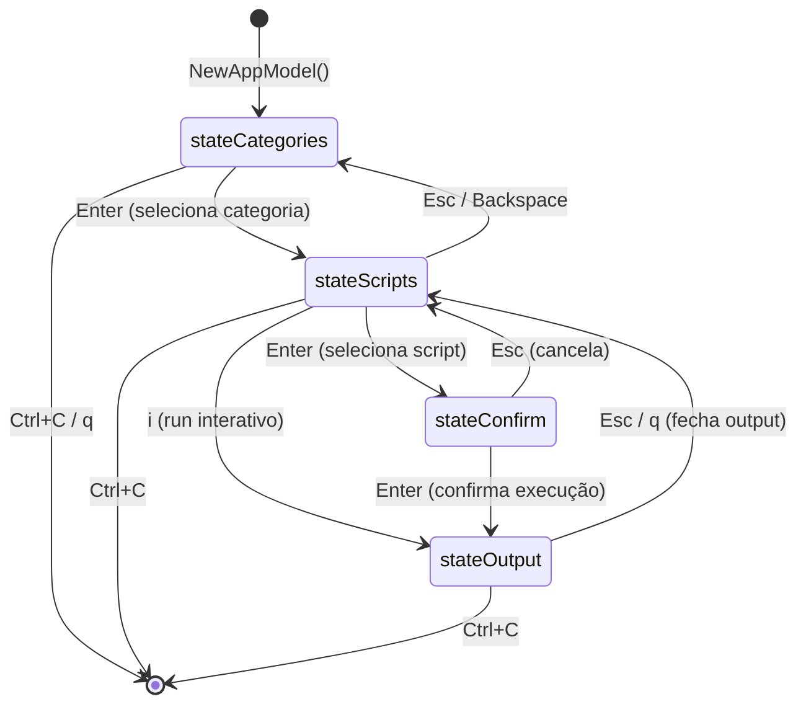
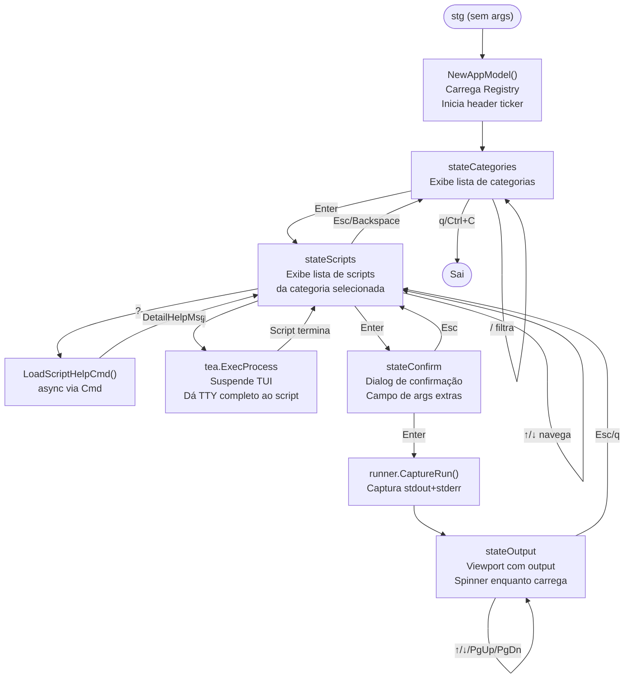
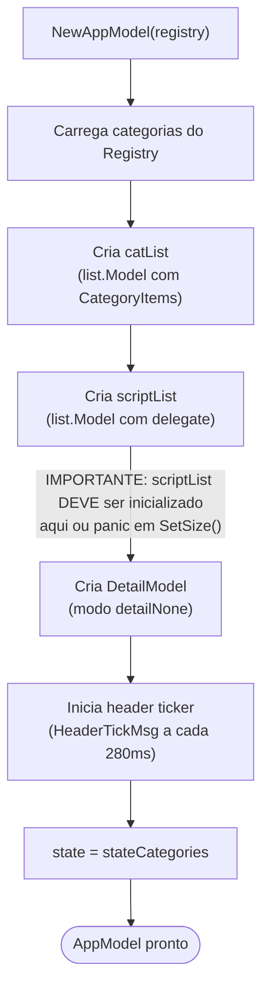
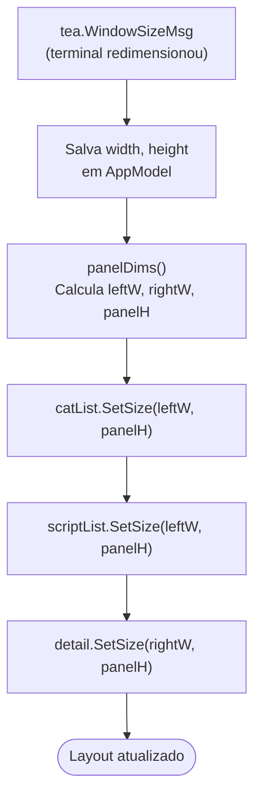
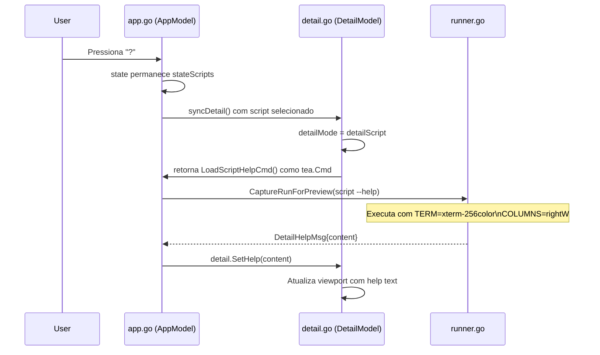

# PRD 02 — TUI: State Machine e Fluxo de Navegação

## Visão Geral

A interface TUI do `stg` é construída com o framework BubbleTea (arquitetura Elm). O estado da aplicação é representado por um único struct `AppModel` que transita entre estados bem definidos conforme o usuário interage.

---

## Estados da Aplicação



---

## Mapa de Key Bindings por Estado

### stateCategories

| Tecla | Ação |
|---|---|
| `↑` / `k` | Move seleção para cima |
| `↓` / `j` | Move seleção para baixo |
| `Enter` | Entra na categoria selecionada → `stateScripts` |
| `/` | Ativa filtro de lista |
| `q` / `Ctrl+C` | Sai do programa |

### stateScripts

| Tecla | Ação |
|---|---|
| `↑` / `k` | Move seleção para cima |
| `↓` / `j` | Move seleção para baixo |
| `Enter` | Confirma script selecionado → `stateConfirm` |
| `i` | Executa script interativo (full TTY) → suspende TUI |
| `?` | Carrega help do script no painel direito |
| `Esc` / `Backspace` | Volta para `stateCategories` |
| `/` | Ativa filtro de lista |
| `Ctrl+C` | Sai do programa |

### stateConfirm

| Tecla | Ação |
|---|---|
| `Enter` | Executa script → `stateOutput` |
| `a` | Foca no campo de argumentos extras |
| `Esc` | Cancela → volta para `stateScripts` |

### stateOutput

| Tecla | Ação |
|---|---|
| `↑` / `k` | Scroll up no viewport |
| `↓` / `j` | Scroll down no viewport |
| `PgUp` / `b` | Page up |
| `PgDn` / `f` | Page down |
| `g` | Vai para o início |
| `G` | Vai para o final |
| `Esc` / `q` | Fecha output → volta para `stateScripts` |
| `Ctrl+C` | Sai do programa |

---

## Fluxo Completo de Navegação



---

## Fluxo de Inicialização (NewAppModel)



> **Atenção:** `list.Model` com valor zero tem delegate `nil`, o que causa panic ao chamar `SetSize()`. O `scriptList` deve ser inicializado com um delegate válido em `NewAppModel`, mesmo que vazio.

---

## Fluxo de Redimensionamento (WindowSizeMsg)



### Fórmula de Dimensionamento

```
leftW  = max((w - 4) * 2 / 5, 10)
rightW = w - leftW - 4        (margens e borda)
panelH = max(h - 6, 5)        (header=3 + helpbar=1 + borders=2)
```

---

## Fluxo de Carregamento de Help Assíncrono



---

## Componentes do Layout

```
┌─────────────────────────────────────────────────────────┐
│  HEADER (3 linhas)                                      │
│  · ° o O  SHOTGUM  ¬══════►  v1.2.3  [link]           │
├──────────────────────┬──────────────────────────────────┤
│                      │                                  │
│  LEFT PANEL          │  RIGHT PANEL (DetailModel)       │
│  (catList /          │                                  │
│   scriptList)        │  - Category mode:                │
│                      │    scripts, source, path         │
│  leftW = max(        │  - Script mode:                  │
│    (w-4)*2/5, 10)    │    path, help flag, metadata     │
│                      │  - Help viewport (scrollable)    │
│                      │                                  │
├──────────────────────┴──────────────────────────────────┤
│  HELP BAR (1 linha) — atalhos contextuais               │
└─────────────────────────────────────────────────────────┘
```

---

## Regras de Negócio

| # | Regra |
|---|---|
| R-TUI-01 | O estado inicial sempre é `stateCategories` |
| R-TUI-02 | `stateOutput` não volta para `stateCategories` — sempre para `stateScripts` |
| R-TUI-03 | `tea.ExecProcess` suspende completamente o TUI — o terminal pertence ao script durante execução interativa |
| R-TUI-04 | `syncDetail()` é value receiver — deve ser chamado como `m = m.syncDetail()` |
| R-TUI-05 | O help de script (`?`) é carregado de forma assíncrona via `tea.Cmd` — nunca bloqueia o event loop |
| R-TUI-06 | `panelDims()` garante mínimos: `leftW >= 10`, `panelH >= 5` para evitar layouts quebrados em terminais pequenos |
| R-TUI-07 | Bordas são aplicadas uma única vez em `renderTwoPanel()` — as views retornam conteúdo sem borda |
| R-TUI-08 | O header ticker envia `HeaderTickMsg` a cada 280ms para animação dos frames |
