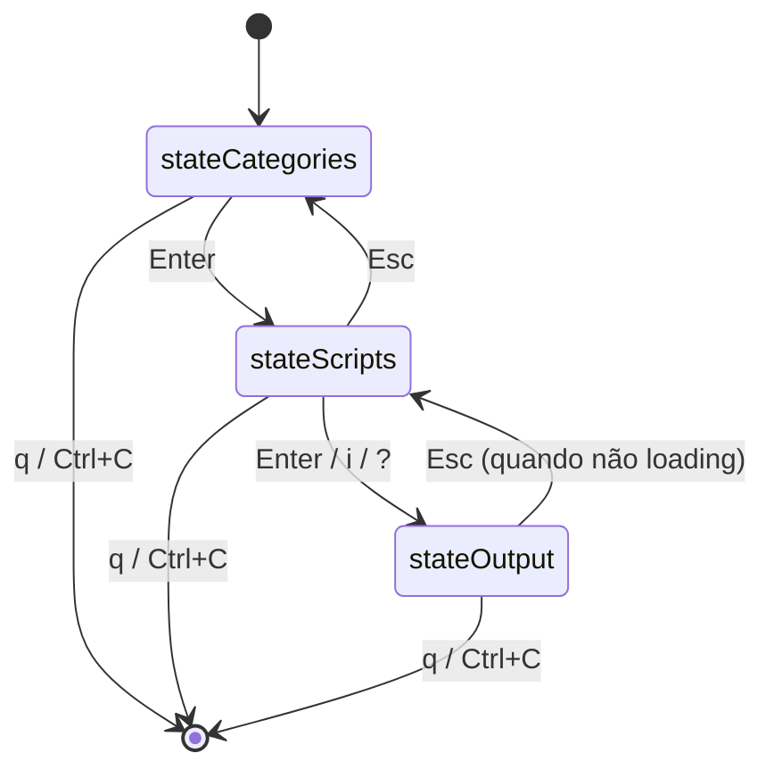

# PRD 02 — TUI: State Machine e Navegação

## Visão Geral

A TUI é implementada em `internal/tui/app.go` usando BubbleTea.

## Estados Ativos



Observação: `stateConfirm` existe no enum, mas não participa do fluxo ativo atual.

## Atalhos por Estado

### `stateCategories`

| Tecla | Ação |
|---|---|
| `↑/k` `↓/j` | Navega categorias |
| `/` | Filtro |
| `Enter` | Entra na categoria |
| `l` | Toggle footer de logs de execução |
| `q` / `Ctrl+C` | Sair |

### `stateScripts`

| Tecla | Ação |
|---|---|
| `↑/k` `↓/j` | Navega scripts |
| `/` | Filtro |
| `Enter` | Executa script (modo interativo no output) |
| `i` | Mesmo comportamento de `Enter` |
| `?` | Executa script com `help_flag` resolvido |
| `tab` | Foca painel de detalhe (scroll do viewport) |
| `esc` | Volta para categorias |
| `l` | Toggle logs |
| `q` / `Ctrl+C` | Sair |

### `stateOutput`

| Tecla | Ação |
|---|---|
| `↑/↓/PgUp/PgDn` | Scroll no output |
| entrada de teclado | Encaminhada ao processo quando interativo e loading |
| `esc` | Volta para scripts (bloqueado durante loading) |
| `q` / `Ctrl+C` | Sair |

## Fluxo de Execução no TUI

```mermaid
flowchart TD
    S[stateScripts] --> K{tecla}
    K -->|Enter/i| R[runScript(entry,nil)]
    K -->|?| H[runScript(entry,[help_flag])]
    R --> O[stateOutput]
    H --> O
    O --> I[runner.StartInteractive]
    I -->|ok| Stream[stream de chunks + input]
    I -->|falha| Fallback[views.RunScriptCmd CaptureRun]
```

## Regras de Negócio

| ID | Regra |
|---|---|
| R-TUI-01 | Estado inicial é `stateCategories` |
| R-TUI-02 | A saída retorna para `stateScripts` (não para categories) |
| R-TUI-03 | Execução no TUI tenta sessão interativa primeiro (`StartInteractive`) |
| R-TUI-04 | Em falha de sessão interativa, há fallback para execução capturada |
| R-TUI-05 | `syncDetail()` em `stateScripts` dispara `LoadScriptHelpCmd` assíncrono |
| R-TUI-06 | `tab` alterna foco para scroll do painel direito |
| R-TUI-07 | `esc` em output loading é bloqueado |
| R-TUI-08 | Footer de logs é alternado por `l` ou `--logs` no comando raiz |
