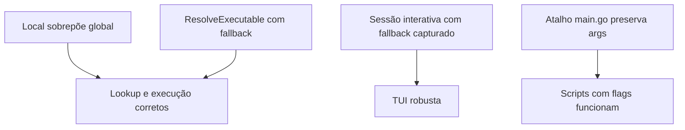

# PRD 08 — Consolidação das Regras de Negócio

## Índice de Domínios

| Domínio | PRD | Prefixo |
|---|---|---|
| Configuração | [01-configuration.md](./01-configuration.md) | R-CFG |
| TUI / Navegação | [02-tui-state-machine.md](./02-tui-state-machine.md) | R-TUI |
| Execução | [03-script-execution.md](./03-script-execution.md) | R-RUN |
| Registry | [04-registry.md](./04-registry.md) | R-REG |
| CLI | [05-cli-commands.md](./05-cli-commands.md) | R-CLI |
| UI/Layout | [06-layout-and-styling.md](./06-layout-and-styling.md) | R-UI |
| Versionamento/CI | [07-versioning-and-release.md](./07-versioning-and-release.md) | R-VER |

## Regras Consolidadas

### R-CFG

| ID | Regra |
|---|---|
| R-CFG-01 | `Source` não é persistido no YAML |
| R-CFG-02 | Config ausente retorna `nil` |
| R-CFG-03 | Descoberta local sobe diretórios a partir do CWD |
| R-CFG-04 | Expansão de `~` e variáveis de ambiente em paths |
| R-CFG-05 | Defaults de `init` incluem `default_executable=/bin/sh` |

### R-TUI

| ID | Regra |
|---|---|
| R-TUI-01 | Estado inicial é `stateCategories` |
| R-TUI-02 | Fluxo ativo usa categories -> scripts -> output |
| R-TUI-03 | Execução no TUI prioriza sessão interativa |
| R-TUI-04 | Falha de sessão interativa cai para execução capturada |
| R-TUI-05 | `esc` em output loading é bloqueado |
| R-TUI-06 | `l` alterna footer de logs |

### R-RUN

| ID | Regra |
|---|---|
| R-RUN-01 | Execução final sempre é `<executable> <path> [args...]` |
| R-RUN-02 | `Run` faz streaming real com stdin/stdout/stderr |
| R-RUN-03 | `CaptureRun` preserva output mesmo com erro |
| R-RUN-04 | Preview de help injeta `TERM` e `COLUMNS` |

### R-REG

| ID | Regra |
|---|---|
| R-REG-01 | Local sobrepõe global |
| R-REG-02 | Scripts são deduplicados por nome na categoria consultada |
| R-REG-03 | `ResolveHelpFlag` nunca retorna vazio |
| R-REG-04 | `ResolveExecutable` sempre retorna valor (fallback `/bin/sh`) |

### R-CLI

| ID | Regra |
|---|---|
| R-CLI-01 | `add` escreve apenas no global |
| R-CLI-02 | `add script` usa `--executable` (não `--type`) |
| R-CLI-03 | Atalho de `main.go` preserva args/flags do script |
| R-CLI-04 | `stg <categoria>` inexistente não quebra a TUI |

### R-UI

| ID | Regra |
|---|---|
| R-UI-01 | `renderTwoPanel` concentra borda/estrutura dos painéis |
| R-UI-02 | `stateOutput` tem view dedicada |
| R-UI-03 | Foco Navigation/Info Container alterna por `tab` |
| R-UI-04 | `confirm.go` está disponível, porém fora do fluxo ativo |

### R-VER

| ID | Regra |
|---|---|
| R-VER-01 | Versão default é `dev` |
| R-VER-02 | `make ci` exige cobertura >= 85% |
| R-VER-03 | CI atual é `ci.yml` com `make ci` |
| R-VER-04 | `install.sh` instala compilando do fonte via ref |

## Invariantes Críticas

